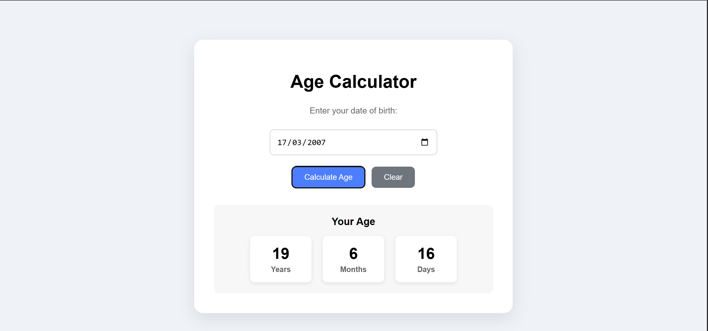

# Age Calculator

A simple and responsive Age Calculator built with **HTML, CSS, and JavaScript**. The application calculates a user's exact age in years, months, and days based on their date of birth.

## 🚀 Live Demo

[View Live Demo](https://zaeemdanish007-hub.github.io/age-calculator/)

## 📸 Screenshot



## ✨ Features

- Calculate age in years, months, and days
- Prevent users from selecting a future date
- Validate empty date input
- Clear the entered date and result
- Responsive and clean user interface
- Built with vanilla HTML, CSS, and JavaScript

## 🛠️ Technologies Used

- HTML5
- CSS3
- JavaScript

## ⚙️ How It Works

1. Select your date of birth.
2. Click **Calculate Age**.
3. The application calculates your current age.
4. Your age is displayed in years, months, and days.
5. Click **Clear** to reset the calculator.

## 📁 Project Structure

```text
age-calculator/
│
├── index.html
├── style.css
├── script.js
├── screenshot.png
└── README.md
```

## 💻 Getting Started

No installation or dependencies are required.

Clone the repository:

```bash
git clone https://github.com/zaeemdanish007-hub/age-calculator.git
cd age-calculator
```

Then open `index.html` in your browser.

## 🎯 Purpose

This project was built to practice JavaScript fundamentals, including DOM manipulation, event listeners, date handling, conditional logic, input validation, and dynamic content rendering.

## 👨‍💻 Author

**Zaeem Danish**

Built as part of my journey of learning and improving my frontend development skills.
